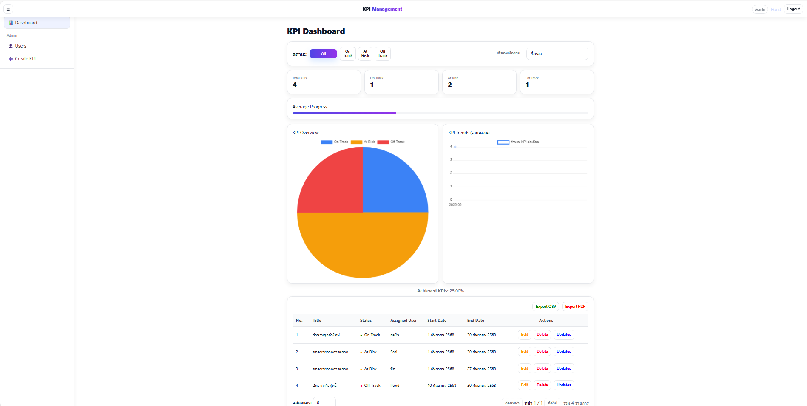
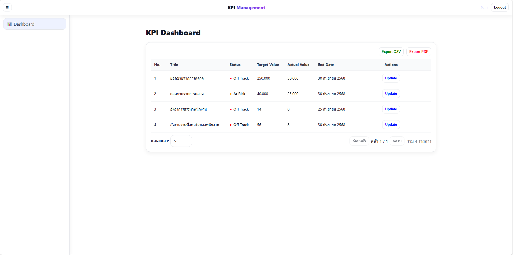
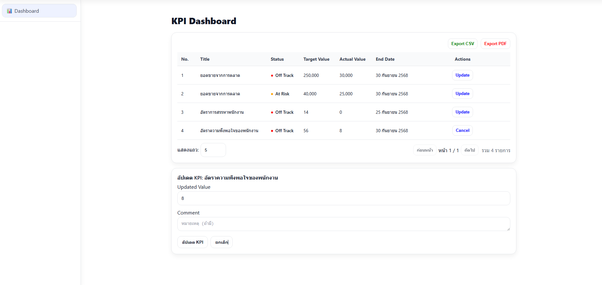
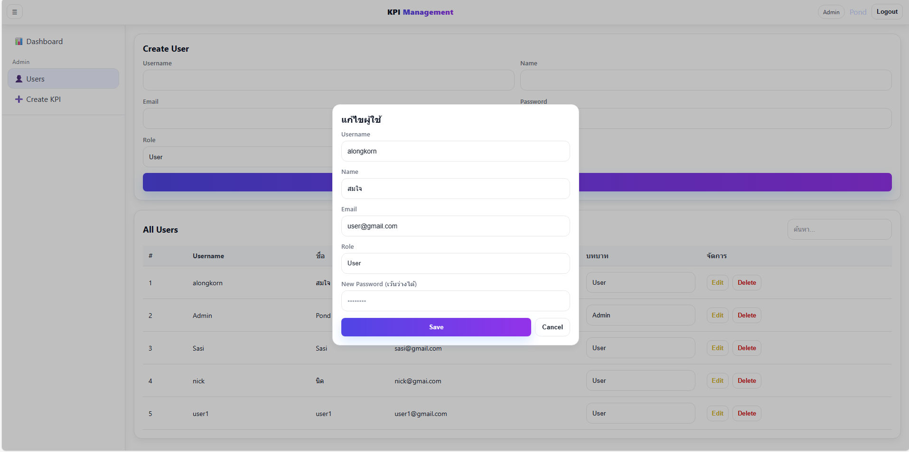
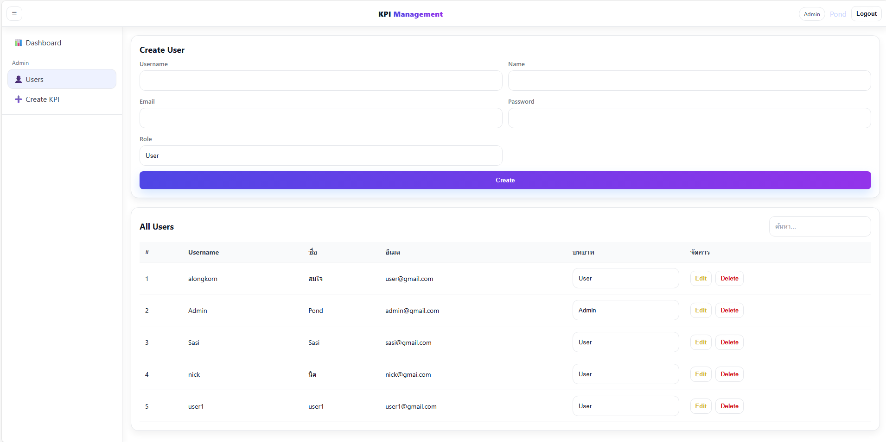
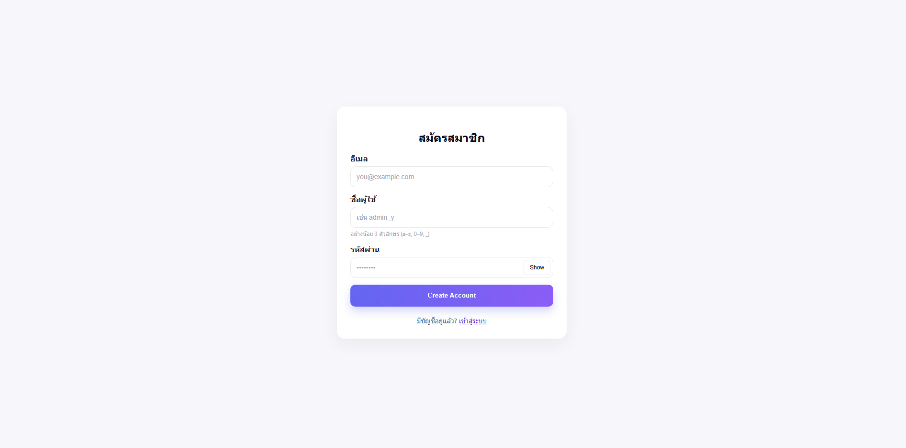
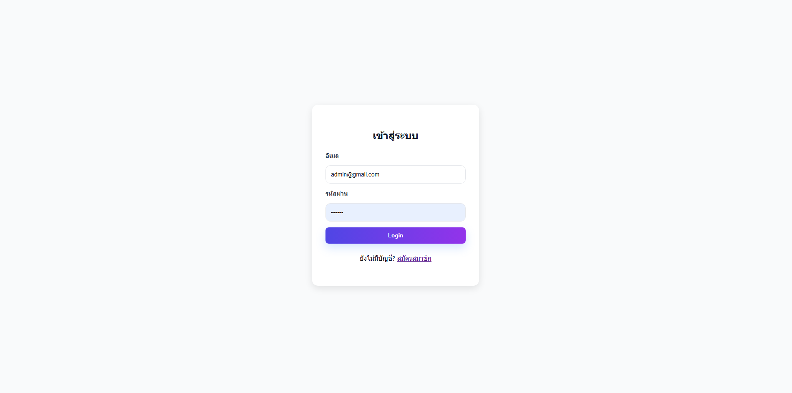

# KPI Management System

Web Application สำหรับบริหารและติดตาม **KPI (Key Performance Indicators)**  
รองรับทั้ง **Admin** และ **User** พร้อมฟีเจอร์ Dashboard, Export, User Management

---

## Features

- Authentication & Authorization (JWT) แยกสิทธิ์ **Admin / User**
- KPI Dashboard พร้อมกราฟวงกลม + กราฟเทรนด์
- CRUD KPI (Create/Read/Update/Delete) และบันทึก **Update Value** เป็นไทม์ไลน์
- จัดการผู้ใช้ (สร้าง/แก้ไข/ลบ, กำหนด Role)
- Export KPI เป็น **CSV / PDF**
- สถานะ KPI: **On Track / At Risk / Off Track**

---

## API Documentation

(Swagger UI):
\*\*`http://localhost:5000/api-docs/#/`

---

##  Screenshots

### Admin Dashboard



### User Dashboard



### Create & Manage KPI


### Update KPI Value (User)



### Edit User Modal



### Create Users



### Register



### Login



---

## 🛠 Tech Stack

| Layer        | Tech                       |
| ------------ | -------------------------- |
| **Frontend** | React, React Router, Axios |
| **Backend**  | Node.js, Express           |
| **Database** | MongoDB (+ Mongoose)       |
| **Auth**     | JWT (JSON Web Token)       |
| **Export**   | CSV, PDF                   |
| **Docs**     | Swagger UI                 |

---

## 📂 Project Structure

```
KPI-APP/
│── kpi-backend/                 # Backend (Node.js + Express + Mongoose)
│   ├── src/
│   │   ├── Controllers/         # Logic จัดการ API (auth, users, kpis, updates)
│   │   ├── middleware/          # Middleware (JWT Auth, Error Handling)
│   │   ├── models/              # Mongoose Models (User, Role, KPI, KPIUpdate)
│   │   ├── routes/              # Routing API (auth.routes.js, user.routes.js, kpi.routes.js)
│   │   ├── services/            # Business logic (เช่น export, calculation)
│   │   ├── utils/               # Utilities (JWT helper, response formatter)
│   │   ├── app.js               # รวม middleware, routes
│   │   ├── index.js             # Entry point หลัก
│   │   └── server.js            # สร้าง server (Express + DB connection)
│   └── package.json                    
│   
│   
│
│── kpi-frontend/                # Frontend (React)
│   ├── public/                  # Static files (index.html, icons, etc.)
│   ├── src/
│   │   ├── api/                 # Axios config, API service functions
│   │   ├── components/          # UI components (Navbar, Sidebar, Charts, Tables)
│   │   ├── context/             # React Context (AuthContext, KPIContext)
│   │   ├── pages/               # Page-level components (Dashboard, KPIList, Login, Register)
│   │   ├── styles/              # CSS/Styling (global + module css)
│   │   ├── App.js               # Routing หลัก
│   │   ├── index.js             # React entry point
│   │   └── main.js              # Setup React app
│   └── package.json                
│   
│   
│
│── screenshots/                 # Screenshots สำหรับ README
│── .gitignore
└──  README.md

```

---

# 1) Backend

โฟลเดอร์: `kpi-backend/`

###  Environment Variables (`kpi-backend/.env`)

```env
PORT=5000
MONGO_URI=mongodb://localhost:27017/kpi_app
JWT_SECRET=your-secret
CLIENT_ORIGIN=http://localhost:5173

# Optional: SMTP (ถ้าใช้ส่งอีเมล)
MAIL_HOST=smtp.example.com
MAIL_PORT=587
MAIL_USER=you@example.com
MAIL_PASS=yourpass
MAIL_FROM="KPI App <you@example.com>"
```
### Clone the repository
```bash
git clone https://github.com/PONDALONG/KPI-Management-System.git
```
---
###  Run

```bash
cd kpi-backend
npm install
npm run dev
# Server: http://localhost:5000
# Swagger: http://localhost:5000/api-docs/#/
```

---

##  Database Schema (MongoDB + Mongoose)

### Roles

```js
const roleSchema = new mongoose.Schema(
  {
    name: {
      type: String,
      enum: ["admin", "user"],
      required: true,
      unique: true,
      trim: true,
    },
  },
  { timestamps: true }
);
```

### Users

```js
const userSchema = new mongoose.Schema(
  {
    username: {
      type: String,
      required: true,
      unique: true,
      minlength: 3,
      maxlength: 50,
    },
    email: { type: String, required: true, unique: true, lowercase: true },
    passwordHash: { type: String, required: true },
    role: { type: mongoose.Schema.Types.ObjectId, ref: "Role", default: null },
  },
  { timestamps: true }
);
```

### KPIs

```js
const kpiSchema = new mongoose.Schema(
  {
    title: { type: String, required: true },
    description: { type: String, default: "" },
    targetValue: { type: Number, required: true },
    actualValue: { type: Number, default: 0 },
    status: {
      type: String,
      enum: ["On Track", "At Risk", "Off Track"],
      default: "Off Track",
    },
    assignedUser: {
      type: mongoose.Schema.Types.ObjectId,
      ref: "User",
      required: true,
    },
    startDate: { type: Date, required: true },
    endDate: { type: Date, required: true },
  },
  { timestamps: true }
);
```

### KPI Updates

```js
const kpiUpdateSchema = new mongoose.Schema(
  {
    kpi: { type: mongoose.Schema.Types.ObjectId, ref: "KPI", required: true },
    updatedValue: { type: Number, required: true },
    comment: { type: String, default: "" },
    updatedBy: {
      type: mongoose.Schema.Types.ObjectId,
      ref: "User",
      default: null,
    },
  },
  { timestamps: { createdAt: false, updatedAt: "updatedAt" } }
);
```

---

# 2) Frontend

โฟลเดอร์: `kpi-frontend/`

###  Environment Variables (`kpi-frontend/.env`)

```env

REACT_APP_API=http://localhost:5000/api
```
---
### Clone the repository
```bash
git clone https://github.com/PONDALONG/KPI-Management-System.git
```
---
###  Run

```bash
cd kpi-frontend
npm install
npm start
# App: http://localhost:5173
```

---

##  การติดตั้งแบบรวม (Quick Start)

```bash
# 1) Clone
git clone https://github.com/PONDALONG/KPI-Management-System.git
cd KPI-Management-System

# 2) Backend
cd kpi-backend
npm install
npm run dev

# 3) Frontend (เปิดอีก terminal)
cd ../kpi-frontend
npm install
npm start
```

---

## 📜 License

MIT © 2025 PONDALONG
