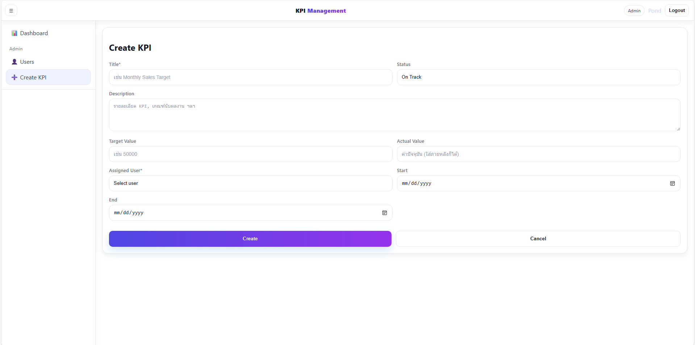

# KPI Management System

Web Application สำหรับบริหารและติดตาม **KPI (Key Performance Indicators)**  
รองรับทั้ง **Admin** และ **User** พร้อมฟีเจอร์ Dashboard, Export, User Management

---

## ✨ Features
-  Authentication & Authorization (JWT) แยกสิทธิ์ **Admin / User**
-  KPI Dashboard พร้อมกราฟวงกลม + กราฟเทรนด์
-  CRUD KPI (Create/Read/Update/Delete) และบันทึก **Update Value** เป็นไทม์ไลน์
-  จัดการผู้ใช้ (สร้าง/แก้ไข/ลบ, กำหนด Role)
-  Export KPI เป็น **CSV / PDF**
-  สถานะ KPI: **On Track / At Risk / Off Track**

---

## 🖼 Screenshots

### Admin Dashboard


### User Dashboard


### Create & Manage KPI


### Update KPI Value (User)


### Edit User Modal


### Create Users


### Register


### Login


---

## 🛠 Tech Stack
| Layer       | Tech |
|------------|------|
| **Frontend** | React, React Router, Axios, (Tailwind CSS หรือ CSS framework ที่คุณใช้) |
| **Backend**  | Node.js, Express |
| **Database** | MongoDB |
| **Auth**     | JWT (JSON Web Token) |
| **Export**   | CSV, PDF |

---

## 📂 Project Structure
```
kpi-app/
│── kpi-backend/      # Backend (Node.js + Express)
│── kpi-frontend/     # Frontend (React)
│── .gitignore
└── README.md
```

---

## ⚙️ Environment Variables

### Backend (`kpi-backend/.env`)
```env
PORT=5000
MONGO_URI=mongodb://localhost:27017/kpi_app
JWT_SECRET=your-secret
CLIENT_ORIGIN=http://localhost:5173

# Optional: SMTP (ถ้าใช้ส่งอีเมล)
MAIL_HOST=smtp.example.com
MAIL_PORT=587
MAIL_USER=you@example.com
MAIL_PASS=yourpass
MAIL_FROM="KPI App <you@example.com>"
```

### Frontend (`kpi-frontend/.env`)
```env
REACT_APP_API=http://localhost:5000/api
```

---

## 🚀 Installation & Running

### 1) Clone Repository
```bash
git clone https://github.com/PONDALONG/KPI-Management-System.git
cd KPI-Management-System
```

### 2) Setup Backend
```bash
cd kpi-backend
npm install
npm run dev
```
- Backend ที่ `http://localhost:5000`

### 3) Setup Frontend
```bash
cd ../kpi-frontend
npm install
npm start
```
- Frontend ที่ `http://localhost:5173` 

---

## 📦 Build / Deploy
- Frontend: `npm run build` (ใน `kpi-frontend/`) แล้ว serve ไฟล์ build ด้วย Express หรือ Nginx/Reverse Proxy
- ตั้งค่า ENV บนเซิร์ฟเวอร์สำหรับทั้ง Backend/Frontend ให้เหมาะกับ Production

---

## 🤝 Contributing
1. Fork repo
2. สร้าง branch: `git checkout -b feature/your-feature`
3. Commit: `git commit -m "feat: add your feature"`
4. Push: `git push origin feature/your-feature`
5. เปิด Pull Request

---

## 📜 License
MIT © 2025 PONDALONG
